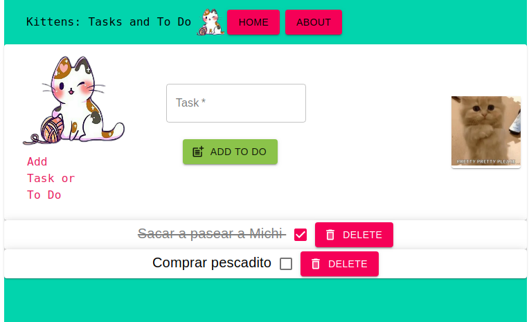

# Kittens: Tasks and To Do :scroll: :tiger2:
> Aplicación de tareas con algunos gatitos.

Los gatitos invaden tus tareas diarias!! 
En esta sencilla aplicación podrás agregar tareas, marcarlas como hechas y eliminarlas.



## Instalación

OS X, Linux y Windows:
Para usarlo lo descargas, y en la carpeta raiz ejecutar el siguiente comando para descargar las dependencias necesarias para correrlo. 
Es requisito tener instalado Node en una versión 12+

```sh
npm install
```

y luego ejecutarlo con:

```sh
npm start
```

## Que usé en este proyecto?

La aplicación está desarrollada en ReactJS y Material UI.


## Historial de versiones
* 0.2.0
    * Se agregan más gatitos
    * Se modifica la interfaz
* 0.1.0
    * First release
    * CAMBIO: se cambian los estilos con `Material UI` 
* 0.0.1
    * Trabajo en progreso, miau! :cat:

## Desarrolladora :computer:

Lujan Rojas – [@LushanKaramakov](https://twitter.com/LushanKaramakov) – lujanrojas.informatica@gmail.com

## Licencia
Distribuido bajo la licencia GNU AFFERO GENERAL PUBLIC LICENSE. Ver ``LICENSE`` para más información.

[https://github.com/DraCaster/](https://github.com/DraCaster/)

***Hecho con amor, miau! - Alt + 3***
